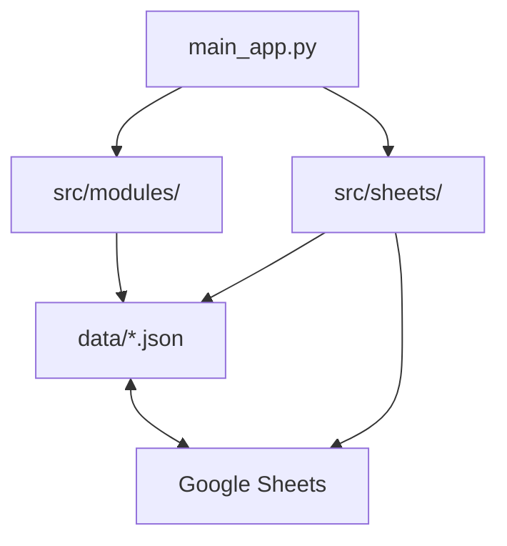

# 📁 Estructura de Archivos - CAR Rugby Club

## 🎯 Organización del Proyecto

La aplicación CAR Rugby Club ha sido reorganizada con una estructura profesional y mantenible:

```
Car/
├── 📱 main_app.py              # Aplicación principal de Streamlit
├── 🖼️ car.jpg                  # Logo del club
├── ⚙️ car_config.py            # Configuración principal
├── 📄 requirements.txt         # Dependencias Python
├── 
├── 📂 src/                     # Código fuente principal
│   ├── 🔧 utils.py             # Utilidades compartidas
│   ├── 📁 modules/             # Módulos de la aplicación
│   │   ├── 🏥 physical_area.py # Área física (tests de fuerza y campo)
│   │   ├── 🔐 login_streamlit.py # Sistema de autenticación
│   │   ├── 📊 club_data.py     # Datos del club
│   │   └── 📋 templates_generator.py # Generador de plantillas
│   └── 📁 sheets/              # Integración Google Sheets
│       ├── 🔄 google_sheets_sync.py # Sincronización principal
│       └── 🖥️ sheets_interface.py # Interfaz de usuario
│
├── 📂 data/                    # Archivos de datos JSON
│   ├── 👥 users_credentials.json # Credenciales de usuarios
│   ├── 🏥 medical_records.json  # Registros médicos
│   ├── 🍎 nutrition_records.json # Registros nutricionales
│   ├── 💪 strength_tests.json   # Tests de fuerza
│   ├── 🏃 field_tests.json      # Tests de campo
│   ├── ⚙️ sync_config.json      # Configuración de sincronización
│   └── 🔑 car_google_credentials_EXAMPLE.json # Ejemplo de credenciales
│
├── 📂 config/                  # Archivos de configuración
│   └── (reservado para futuras configuraciones)
│
├── 📂 docs/                    # Documentación
│   ├── 📖 README.md            # Documentación principal
│   ├── 📝 GUIA_USO.md          # Guía de uso
│   ├── 🔧 GOOGLE_SHEETS_SETUP.md # Configuración Google Sheets
│   ├── 🎨 LOGO_GUIDE.md        # Guía de logos
│   └── 📁 ESTRUCTURA_ARCHIVOS.md # Este archivo
│
└── 📂 templates/               # Plantillas y recursos
    └── (plantillas futuras)
```

## 🔧 Beneficios de la Nueva Estructura

### ✅ Organización Lógica
- **`src/`**: Todo el código fuente está centralizado
- **`data/`**: Archivos JSON separados del código
- **`docs/`**: Documentación unificada
- **`config/`**: Configuraciones específicas

### 🚀 Mantenibilidad
- **Módulos separados**: Cada área tiene su propio archivo
- **Imports claros**: Rutas bien definidas
- **Escalabilidad**: Fácil agregar nuevos módulos

### 🎯 Profesionalismo
- **Estructura estándar**: Sigue buenas prácticas de Python
- **Separación de responsabilidades**: Cada carpeta tiene un propósito específico
- **Documentación completa**: Todo está documentado

## 🛠️ Cómo Ejecutar la Aplicación

```bash
# Navegar al directorio del proyecto
cd C:\Users\dell\Desktop\Car

# Ejecutar la aplicación
streamlit run main_app.py
```

## 📦 Módulos Principales

### 🏥 Área Física (`src/modules/physical_area.py`)
- Tests de fuerza (sentadillas, press banca, peso muerto)
- Tests de campo (velocidad, agilidad, resistencia)
- Perfiles de jugadores
- Estadísticas y análisis

### 🔄 Google Sheets (`src/sheets/`)
- **`google_sheets_sync.py`**: Motor de sincronización
- **`sheets_interface.py`**: Interfaz de usuario
- Sincronización bidireccional de todos los datos

### 🔧 Utilidades (`src/utils.py`)
- Funciones de carga/guardado JSON
- Validaciones de datos
- Utilidades compartidas

## 🔄 Flujo de Datos



## 🎉 Resultado

La aplicación ahora tiene:
- ✅ Estructura profesional y organizada
- ✅ Fácil mantenimiento y escalabilidad
- ✅ Separación clara de responsabilidades
- ✅ Documentación completa
- ✅ Todos los módulos funcionando correctamente

¡La aplicación CAR Rugby Club está lista para usar con su nueva estructura mejorada! 🚀